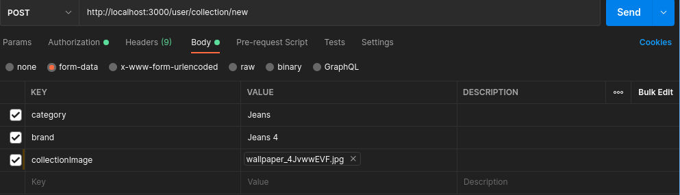

# Wardo App backend

This backend is implemented using node-express framework.

<br>

- [Wardo App backend](#wardo-app-backend)
  - [API Endpoints](#api-endpoints)
    - [Authentication Module](#authentication-module)
    - [Collections Module](#collections-module)
    - [Looks Module](#looks-module)
    - [Shopping List Module](#shopping-list-module)
  - [Models Structure](#models-structure)
    - [User Model](#user-model)
      - [Example](#example)
    - [User RefreshToken Model](#user-refreshtoken-model)
      - [Example](#example-1)
    - [Collections Model](#collections-model)
      - [Example](#example-2)
    - [Looks Model](#looks-model)
      - [Example](#example-3)
    - [Shopping List Model](#shopping-list-model)
      - [Example](#example-4)

## API Endpoints

<br>

### Authentication Module

> **Base URL:** /auth

<br>

1. **POST** http://localhost:3000/auth/verify

    These are the parameter:

    | Parameter | Type   | Require? | Description                                                |
    | --------- | ------ | -------- | ---------------------------------------------------------- |
    | phoneNo   | Number | True     | The phone number with country code which is to be verified |

    This will send an _otp_ to the given phone number and send a response. If the _statusCode_ is _200_ that means otp send sucessfully

    - **Example:**

        ```json
        POST http://localhost:3000/auth/verify HTTP/1.1
        content-type: application/json

        {
        	"phoneNo": 912223334445
        }
        ```

    - **Response:**

        ```json
        {
        	"message": "Otp Send Sucessfully",
        	"data": {
        		"phoneNo": "+912223334445",
        		"channel": "sms",
        		"status": "pending",
        		"valid": false,
        		"lookup": {
        			"carrier": {
        				"mobile_country_code": "234",
        				"type": "mobile",
        				"error_code": null,
        				"mobile_network_code": "234",
        				"name": "XXX"
        			}
        		},
        		"statusCode": 200
        	}
        }
        ```

<br>

2.  **POST** http://localhost:3000/auth/verify/otp

    These are the parameter:

    | Parameter | Type   | Require? | Description                                                |
    | --------- | ------ | -------- | ---------------------------------------------------------- |
    | phoneNo   | Number | True     | The phone number with country code which is to be verified |
    | otp       | Number | True     | The otp which is send by the server to verify the number   |

    This endpoint will verify the authenticity of the phone number. This the opt is approved and verified then the _data.valid_ must be _true_ and _statusCode_ is _200_.

    If the opt is invalid then the _statusCode_ is _403_.

    -   **Example:**

        ```json
        POST http://localhost:3000/auth/verify/otp HTTP/1.1
        Content-Type: application/json

        {
        	"phoneNo": 912223334445,
        	"otp": "0363"
        }
        ```

    -   **Response:** (If verified)

        ```json
        {
        	"message": "Phone number verified",
        	"data": {
        		"phoneNo": "+912223334445",
        		"channel": "sms",
        		"status": "approved",
        		"valid": true,
        		"statusCode": 200
        	}
        }
        ```

    -   **Response:** (If not verified)

        ```json
        {
        	"message": "Could not verify the phone number!",
        	"statusCode": 403
        }
        ```

<br>

3.  **POST** http://localhost:3000/auth/user/signup

    These are the parameter:

    | Parameter | Type   | Require? | Description                                                   |
    | --------- | ------ | -------- | ------------------------------------------------------------- |
    | name      | String | True     | The name of the user                                          |
    | phoneNo   | Number | True     | The Phone Number of the user                                  |
    | password  | String | True     | The password for the user account                             |
    | age       | Number | True     | Age of the user                                               |
    | gender    | String | True     | The gender of the user (Either Male/Female/Prefer Not to Say) |
    | verified  | Bool   | False    | True if the user is verified. Default is false                |

    This endpoint will create a new user and store it into database. Each user must have a unique Phone Number. If user try to register with existing phone number then it will throw an error

    -   **Example:**

        ```json
        POST http://localhost:3000/auth/user/signup HTTP/1.1
        Content-Type: application/json

        {
        	"name": "Dummy name",
        	"phoneNo": "2223334445",
        	"password": "test2222",
        	"age": "18",
        	"gender": "Male"
        }
        ```

    -   **Response:**

        ```json
        {
        	"message": "User register sucessfully!",
        	"user": {
        		"_id": "60f7f6294f5e92385b740625",
        		"name": "Raman Preet Singh"
        	},
        	"statusCode": 201
        }
        ```

    -   **Response:** (With already register phone number)

        ```json
        {
        	"message": "Invalid Data",
        	"errors": [
        		{
        			"message": "User already register with this phone number. Sign In instead?",
        			"value": "2223334445",
        			"param": "phoneNo"
        		}
        	],
        	"statusCode": 400
        }
        ```

<br>

4.  **POST** http://localhost:3000/auth/user/signin/password

    These are the parameter:

    | Parameter | Type   | Require? | Description                       |
    | --------- | ------ | -------- | --------------------------------- |
    | phoneNo   | Number | True     | The Phone Number of the user      |
    | password  | String | True     | The password for the user account |

    This endpoint will return the access token and refresh token for the user. The refresh token is stored in the database to regenerate the access token on the further request.

    -   **Example:**

        ```json
        POST http://localhost:3000/auth/user/signin/password HTTP/1.1
        Content-Type: application/json

        {
        	"phoneNo": "2223334445",
        	"password": "test2222"

        }
        ```

    -   **Response:** (If authenticated)

        ```json
        {
        	"message": "User Signin sucessfull",
        	"user": {
        		"id": "60f68cafb93500d6605a6584",
        		"phoneNo": 7347501113
        	},
        	"accessToken": "XXXXX",
        	"refreshToken": "XXXXX",
        	"statusCode": 200
        }
        ```

    -   **Response:** (If not authenticated)

        ```json
        {
        	"message": "Invalid Password!",
        	"statusCode": 401
        }
        ```

<br>

5.  **POST** http://localhost:3000/auth/user/signin/refresh

    These are the parameter:

    | Parameter    | Type   | Require? | Description           |
    | ------------ | ------ | -------- | --------------------- |
    | refreshToken | String | True     | A valid refresh token |

    This endpoint will regenrate the access token if the valid refresh token is supplied.

    -   **Example:**

        ```json
        POST http://localhost:3000/auth/user/signin/refresh HTTP/1.1
        Content-Type: application/json

        {
        	"refreshToken": "XXXXX"

        }
        ```

    -   **Response:** (If verified)

        ```json
        {
        	"message": "Access Token generated!",
        	"accessToken": "XXXXX",
        	"refreshToken": "XXXXX",
        	"statusCode": 200
        }
        ```

    -   **Response:** (If not verified)

        ```json
        {
        	"message": "Invalid Refresh Token!",
        	"statusCode": 403
        }
        ```

<br>
<hr>

**Note:** To access all of the remaining modules you need to have a access token. The access token should be supplied in the _Authorization_ header with Bearer Prefix

<hr>
<br>

6. **POST** http://localhost:3000/auth/user/change/password

    These are the parameter:

    | Parameter   | Type   | Require? | Description              |
    | ----------- | ------ | -------- | ------------------------ |
    | oldPassword | String | True     | Old Password of the user |
    | newPassword | String | True     | New Password of the user |

    This endpoint will change the password from oldPassword to the new Password for user.

    - **Example:**

        ```json
        POST http://localhost:3000/auth/user/change/password HTTP/1.1
        Content-Type: application/json
        Authorization: Bearer XXXXX

        {
        	"oldPassword": "old_password",
        	"newPassword": "new_password"

        }
        ```

### Collections Module

> **Base URI**: /user/collection

<br>

1. **GET** http://localhost:3000/user/collection?category={category}

    These are the accepted query parameter:

    | Parameter | Type   | Require? | Description                           |
    | --------- | ------ | -------- | ------------------------------------- |
    | category  | String | False    | A valid category to filter collection |

    This endpoint will returns all the collection of user if no query parameter is given. If the query parameter is given, it will filter the result based on that.

    - **Example:** (Without query parameter)

        ```json
        GET http://localhost:3000/user/collection HTTP/1.1
        Authorization: Bearer XXXXX
        ```

    - **Response:**

        ```json
        {
        	"message": "Collection Fetched Sucessfully",
        	"collections": [
        		{
        			"_id": "60ee92afe237642b34491188",
        			"category": "Dresses",
        			"brand": "Dress 1",
        			"imageURI": "/images/collections/Collection_60e9dc49dc64bf157d2ba358_1626247855254.jpeg"
        		},
        		{
        			"_id": "60ee92c2e237642b3449118c",
        			"category": "Dresses",
        			"brand": "Dress 2",
        			"imageURI": "/images/collections/Collection_60e9dc49dc64bf157d2ba358_1626247873986.jpeg"
        		},
        		{
        			"_id": "60ee92e7e237642b34491194",
        			"category": "Shirts",
        			"brand": "Shirt 1",
        			"imageURI": "/images/collections/Collection_60e9dc49dc64bf157d2ba358_1626247911391.jpeg"
        		},
        		{
        			"_id": "60ee92ede237642b34491198",
        			"category": "Shirts",
        			"brand": "Shirt 2",
        			"imageURI": "/images/collections/Collection_60e9dc49dc64bf157d2ba358_1626247917014.jpeg"
        		},
        		{
        			"_id": "60ee9304e237642b344911a0",
        			"category": "Jeans",
        			"brand": "Jeans 1",
        			"imageURI": "/images/collections/Collection_60e9dc49dc64bf157d2ba358_1626247939796.jpeg"
        		},
        		{
        			"_id": "60ee9308e237642b344911a4",
        			"category": "Jeans",
        			"brand": "Jeans 2",
        			"imageURI": "/images/collections/Collection_60e9dc49dc64bf157d2ba358_1626247944502.jpeg"
        		}
        	],
        	"statusCode": 200
        }
        ```

    - **Example:** (With query parameter)

        ```json
        GET http://localhost:3000/user/collection?category=Dresses HTTP/1.1
        Authorization: Bearer XXXXX
        ```

    - **Response:**

        ```json
        {
        	"message": "Collection Fetched Sucessfully",
        	"collections": [
        		{
        			"_id": "60ee92afe237642b34491188",
        			"category": "Dresses",
        			"brand": "Dress 1",
        			"imageURI": "/images/collections/Collection_60e9dc49dc64bf157d2ba358_1626247855254.jpeg"
        		},
        		{
        			"_id": "60ee92c2e237642b3449118c",
        			"category": "Dresses",
        			"brand": "Dress 2",
        			"imageURI": "/images/collections/Collection_60e9dc49dc64bf157d2ba358_1626247873986.jpeg"
        		}
        	],
        	"statusCode": 200
        }
        ```

<br>

2. **POST** http://localhost:3000/user/collection/new

    These are the accepted parameter:

    | Parameter       | Type                                               | Require? | Description                                              |
    | --------------- | -------------------------------------------------- | -------- | -------------------------------------------------------- |
    | category        | String                                             | True     | A valid category for the collection                      |
    | brand           | String                                             | True     | A valid brand name for collection                        |
    | collectionImage | application/png, application/jpg, application/jpeg | True     | Image of the collection in png, jpg or jpeg formate only |

    This endpoint will create a new collection with the given data and return the newly created collection document

    - **Example:**
      

    <br><hr>

    **_Note:_** Please provide the Authorization header with Bearer access token for verification.
     <hr><br>

    - **Response:**
        ```json
        {
        	"messsage": "Collection saved Sucessfully",
        	"collection": {
        		"_id": "60ee9b59fb7f3d65204b02a4",
        		"category": "Jeans",
        		"brand": "Jeans 4",
        		"image": "/images/collections/Collection_60e9dc49dc64bf157d2ba358_1626250073549.jpeg"
        	},
        	"statusCode": 201
        }
        ```

<br>

3. **Delete** http://localhost:3000/user/collection/delete/{collectionId}

    These are the accepted url parameter:

    | Parameter    | Type       | Require? | Description                                              |
    | ------------ | ---------- | -------- | -------------------------------------------------------- |
    | collectionId | DocumentID | True     | The document id of the collection which is to be deleted |

    This endpoint will delete the given document and return the status.

    - **Example:**

        ```json
        DELETE http://localhost:3000/user/collection/delete/60ed7b22fe3f599a7b48a597 HTTP/1.1
        Authorization: Bearer XXXXX
        ```

    - **Response:**

        ```json
        {
        	"message": "Procuct deleted Sucessfully",
        	"statusCode": 200
        }
        ```

<br>

### Looks Module

> **Base URI**: /user/looks

<br>

1. **GET** http://localhost:3000/user/collection?type={type}

    These are the accepted query parameter:

    | Parameter | Type   | Require? | Description                 |
    | --------- | ------ | -------- | --------------------------- |
    | type      | String | False    | Type of look to be filtered |

    This endpoint will returns all the looks of a given user if no query parameter is given. If the query parameter is given, it will filter the result based on that.

    - **Example:** (Without query parameter)

        ```json
        GET http://localhost:3000/user/looks HTTP/1.1
        Authorization: Bearer XXXXX
        ```

    - **Response:**

        ```json
        {
        	"message": "Looks fetched Sucessfully",
        	"looks": [
        		{
        			"_id": "60ee9e0ffb7f3d65204b02ae",
        			"type": "Casual",
        			"name": "Casual 1",
        			"clothings": [
        				{
        					"_id": "60ee92afe237642b34491188",
        					"category": "Dresses",
        					"brand": "Dress 1",
        					"imageURI": "/images/collections/Collection_60e9dc49dc64bf157d2ba358_1626247855254.jpeg"
        				},
        				{
        					"_id": "60ee9308e237642b344911a4",
        					"category": "Jeans",
        					"brand": "Jeans 2",
        					"imageURI": "/images/collections/Collection_60e9dc49dc64bf157d2ba358_1626247944502.jpeg"
        				}
        			]
        		},
        		{
        			"_id": "60ee9e63f0b478750d0e61b6",
        			"type": "Casual",
        			"name": "Casual 2",
        			"clothings": [
        				{
        					"_id": "60ee92afe237642b34491188",
        					"category": "Dresses",
        					"brand": "Dress 1",
        					"imageURI": "/images/collections/Collection_60e9dc49dc64bf157d2ba358_1626247855254.jpeg"
        				}
        			]
        		}
        	],
        	"statusCode": 200
        }
        ```

    - **Example:** (with query parameter)

        ```json

        GET http://localhost:3000/user/looks?type=Party HTTP/1.1
        Authorization: Bearer XXXXX
        ```

    - **Response:**
        ```json
        {
        	"message": "Looks fetched Sucessfully",
        	"looks": [
        		{
        			"_id": "60ee9fb7a62eff7ac0b21ae4",
        			"type": "Party",
        			"name": "Party 1",
        			"clothings": [
        				{
        					"_id": "60ee92cae237642b34491190",
        					"category": "Dresses",
        					"brand": "Dress 3",
        					"imageURI": "/images/collections/Collection_60e9dc49dc64bf157d2ba358_1626247882204.jpeg"
        				}
        			]
        		},
        		{
        			"_id": "60eea052a62eff7ac0b21aeb",
        			"type": "Party",
        			"name": "Party 2",
        			"clothings": [
        				{
        					"_id": "60ee92ede237642b34491198",
        					"category": "Shirts",
        					"brand": "Shirt 2",
        					"imageURI": "/images/collections/Collection_60e9dc49dc64bf157d2ba358_1626247917014.jpeg"
        				},
        				{
        					"_id": "60ee99478c788f591ce45ead",
        					"category": "Jeans",
        					"brand": "Jeans 4",
        					"imageURI": "/images/collections/Collection_60e9dc49dc64bf157d2ba358_1626249543116.jpeg"
        				}
        			]
        		}
        	],
        	"statusCode": 200
        }
        ```

<br>

2. **POST** http://localhost:3000/user/looks/new

    These are the accepted parameter:

    | Parameter | Type                         | Require? | Description                                                          |
    | --------- | ---------------------------- | -------- | -------------------------------------------------------------------- |
    | type      | String                       | True     | Type of the look                                                     |
    | name      | String                       | True     | A valid name for the look                                            |
    | clothings | Array of the collection id's | True     | An array of the collection id which is to be added in the given look |

    This endpoint will create a new look with the given data and return the newly created look document

    - **Example:**

        ```json
        POST  http://localhost:3000/user/looks/new HTTP/1.1
        Content-Type: application/json
        Authorization: Bearer XXXXX

        {
            "type": "Casual",
            "name": "Casual 2",
            "clothings": [
                "60ee92afe237642b34491188",
                "60ee930ee237642b344911a8"
            ]
        }
        ```

    - **Response:**

        ```json
        {
        	"message": "Look created sucessfully!",
        	"look": {
        		"_id": "60ee9fb7a62eff7ac0b21ae4",
        		"type": "Casual",
        		"name": "Casual 2"
        	},
        	"statusCode": 201
        }
        ```

<br>

1. **Delete** http://localhost:3000/user/collection/delete/{lookId}

    These are the accepted url parameter:

    | Parameter | Type       | Require? | Description                                        |
    | --------- | ---------- | -------- | -------------------------------------------------- |
    | lookId    | DocumentID | True     | The document id of the look which is to be deleted |

    This endpoint will delete the given document and return the status. If the lookId is incorrect or there is no look it will give status of 404.

    - **Example:**

        ```json
        DELETE http://localhost:3000/user/looks/delete/60ed7c8e0598789fcc3b00d9 HTTP/1.1
        Authorization: Bearer XXXXX
        ```

    - **Response:** (If look is found)

        ```json
        {
        	"message": "Look deleted Sucessfully",
        	"statusCode": 200
        }
        ```

    - **Response:** (If no look found)

        ```json
        {
        	"message": "No Look Found",
        	"statusCode": 404
        }
        ```

<br>

### Shopping List Module

> **Base URI**: /user/looks

<br>

1. **GET** http://localhost:3000/user/shopping/list/all

    This endpoint will returns all the shopping list that are created by the user.

    - **Example:**

        ```json
        GET http://localhost:3000/user/shopping/list/all HTTP/1.1
        Authorization: Bearer XXXXX
        ```

    - **Response:**

        ```json
        {
        	"message": "Shopping List fetched sucessfully",
        	"list": [
        		{
        			"items": ["Item 1", "Item 2"],
        			"_id": "60f68d07b93500d6605a658b",
        			"title": "List 1"
        		},
        		{
        			"items": ["Item 1", "Item 2", "Item 3"],
        			"_id": "60f6b27782c86ea46c7c18e8",
        			"title": "List 2"
        		}
        	],
        	"statusCode": 200
        }
        ```

<br>

2. **GET** http://localhost:3000/user/shopping/list/{{ listID }}

    These are the accepted url parameter:

    | Parameter | Type       | Require? | Description                                         |
    | --------- | ---------- | -------- | --------------------------------------------------- |
    | listId    | DocumentID | True     | The document id of the list which is to be featched |

    This endpoint will returns the specific list documuet.

    - **Example:**

        ```json
        GET http://localhost:3000/user/shopping/list/60f68d07b93500d6605a658b HTTP/1.1
        Authorization: Bearer XXXXX
        ```

    - **Response:**

        ```json
        {
        	"message": "Shopping List fetched Sucessfully",
        	"list": {
        		"_id": "60f68d07b93500d6605a658b",
        		"title": "List 1",
        		"items": ["Item 1", "Item 2"]
        	},
        	"statusCode": 200
        }
        ```

<br>

3. **POST** http://localhost:3000/user/shopping/list/new

    These are the accepted parameter:

    | Parameter | Type     | Require? | Description                                         |
    | --------- | -------- | -------- | --------------------------------------------------- |
    | title     | String   | True     | Title for the new shopping list                     |
    | items     | [String] | True     | Array of the items which is to be added in the list |

    This endpoint will create a new shopping list document.

    - **Example:**

        ```json
        POST http://localhost:3000/user/shopping/list/new HTTP/1.1
        Content-Type: application/json
        Authorization: Bearer XXXXX

        {
        	"title":"List 3",
        	"items": [
        		"Item 1",
        		"Item 2",
        		"Item 3"
        	]
        }
        ```

    - **Response:**

        ```json
        {
        	"message": "Shopping List Created Sucessfully",
        	"list": {
        		"_id": "60f8024c0e4832747e51cac7",
        		"title": "List 5"
        	},
        	"statusCode": 201
        }
        ```

<br>

4. **Delete** http://localhost:3000/user/shopping/list/{{ listID }}

    These are the accepted url parameter:

    | Parameter | Type       | Require? | Description                                        |
    | --------- | ---------- | -------- | -------------------------------------------------- |
    | listId    | DocumentID | True     | The document id of the list which is to be deleted |

    This endpoint will delete the specific list documuet.

    - **Example:**

        ```json
        GET http://localhost:3000/user/shopping/list/delete/60f68d07b93500d6605a658b HTTP/1.1
        Authorization: Bearer XXXXX
        ```

    - **Response:**

        ```json
        {
        	"message": "List Deleted Sucessfully",
        	"statusCode": 200
        }
        ```

<br>

1. **PUT** http://localhost:3000/user/shopping/list/update/{{ listId }}

    These are the accepted url parameter:

    | Parameter | Type       | Require? | Description                                        |
    | --------- | ---------- | -------- | -------------------------------------------------- |
    | listId    | DocumentID | True     | The document id of the list which is to be updated |

    These are the accepted parameter:

    | Parameter | Type | Require? | Description |
    | title | String | True | Title for the new shopping list |
    | items | [String] | True | Array of the items which is to be added in the list |

    This endpoint will delete the specific list documuet.

    - **Example:**

        ```json
        PUT http://localhost:3000/user/shopping/list/update/60f69191626e3ef4a8b83185 HTTP/1.1
        Content-Type: application/json
        Authorization: Bearer XXXXX


        {
        	"title":"List 99",
        	"items": [
        		"Item 1",
        		"Item 2"
        	]
        }
        ```

    - **Response:**

        ```json
        {
        	"message": "List Updated Sucessfully",
        	"statusCode": 200
        }
        ```

<br>

## Models Structure

<br>

### User Model

<br>

This model store the basic information for the user.

<br>

| Field Name    | Type                               | Description                                    |
| ------------- | ---------------------------------- | ---------------------------------------------- |
| Name          | String                             | **REQUIRED** Name of the user                  |
| Password      | String                             | **REQUIRED** Password of the user              |
| Phone No.     | Integer                            | **REQUIRED** Phone Number of the user          |
| Age           | Integer                            | **REQUIRED** Age of the user                   |
| Gender        | String                             | **REQUIRED** Gender of the user                |
| Verified      | Boolean                            | _True_ if user is verified. Default is _false_ |
| Collection    | [Object ID \| Collection Schema]   | The list of the collection that the user have  |
| Looks         | [Object ID \| Looks Schema]        | The list of the looks that the user have       |
| Shopping List | [Object ID \| ShoppingList Schema] | The list of the shopping list user have        |

<br>

#### Example

```json
{
	"_id": "60e9dc49dc64bf157d2ba358",
	"prefrenceStyle": "Male",
	"verified": false,
	"name": "Test User",
	"phoneNo": "2223334445",
	"password": "$2b$11$C0eHB16PNmZX7N5T3C5iV.a5LpSADw03UeaqQu/ws2y5V8i14tZCG",
	"age": "18",
	"gender": "Male",
	"collections": [
		"60ed7b0ffe3f599a7b48a58b",
		"60ed7b16fe3f599a7b48a58f",
		"60ed7b1cfe3f599a7b48a593"
	],
	"looks": ["60ed7bc20598789fcc3b00be", "60ed7be70598789fcc3b00c4"],
	"shoppingList": ["60ed7bc20598789fcc3322o", "60ed7be70598789fcc3b0032"]
}
```

<br>

### User RefreshToken Model

<br>
This model stores the refresh token for all the user.

<br>
<br>

| Field Name | Type                    | Description                                           |
| ---------- | ----------------------- | ----------------------------------------------------- |
| Token      | uuid                    | **REQUIRED** The refresh token of the user            |
| User Id    | Object Id\| User Schema | **REQUIRED** The user id                              |
| Expires At | Date                    | **REQUIRED** The expiration date of the refresh token |

<br>

#### Example

```json
{
	"_id": "60eaf28ac7a450125b07d7f6",
	"token": "9ab3819e-4459-4ff8-acb3-0ad95643acf4",
	"userId": "60eaf12aec62340d7d2eda5a",
	"expiresAt": "2021-07-12T03:25:20.606+00:00"
}
```

<br>

### Collections Model

<br>
This model stores the collections of the user
<br>
<br>

| Field Name | Type                        | Description                                           |
| ---------- | --------------------------- | ----------------------------------------------------- |
| Category   | String                      | **REQUIRED** The category of the collection           |
| Image URI  | String                      | **REQUIRED** The image url of the collection          |
| Brand      | String                      | **REQUIRED** The brand of the collection              |
| User Id    | Object Id\| User Schema     | **REQUIRED** The user id for the collection           |
| Looks      | [Object Id \| Looks Schema] | The id's of the looks in the collections are required |

<br>

#### Example

```json
{
	"_id": "60ee92afe237642b34491188",
	"looks": ["60ee9e0ffb7f3d65204b02ae", "60ee9e63f0b478750d0e61b6"],
	"category": "Dresses",
	"brand": "Dress 1",
	"imageURI": "/images/collections/Collection_60e9dc49dc64bf157d2ba358_1626247855254.jpeg",
	"userId": "60e9dc49dc64bf157d2ba358"
}
```

<br>

### Looks Model

<br>
This model stores the collections of the user
<br>
<br>

| Field Name | Type                              | Description                                               |
| ---------- | --------------------------------- | --------------------------------------------------------- |
| User Id    | Object Id\| User Schema           | **REQUIRED** The user id for the collection               |
| Type       | String                            | **REQUIRED** Type of look                                 |
| Name       | String                            | **Required** Name of the look                             |
| Clothings  | [Object Id \| Collections Schema] | The id's of the collection which is required in the looks |

#### Example

```json
{
	"_id": "60ee9e63f0b478750d0e61b6",
	"clothings": ["60ee92afe237642b34491188", "60ee930ee237642b344911a8"],
	"type": "Casual",
	"name": "Casual 2",
	"userId": "60e9dc49dc64bf157d2ba358"
}
```

### Shopping List Model

<br>
This model stores the collections of the user
<br>
<br>

| Field Name | Type                    | Description                              |
| ---------- | ----------------------- | ---------------------------------------- |
| User Id    | Object Id\| User Schema | **REQUIRED** The user id                 |
| Title      | String                  | **REQUIRED** Title for the shopping list |
| Items      | [String]                | **Required** Items in the shopping list  |

#### Example

```json
{
	"_id": "60f68d07b93500d6605a658b",
	"items": ["Item 1", "Item 2"],
	"userId": "60f68cafb93500d6605a6584",
	"title": "List 1"
}
```
